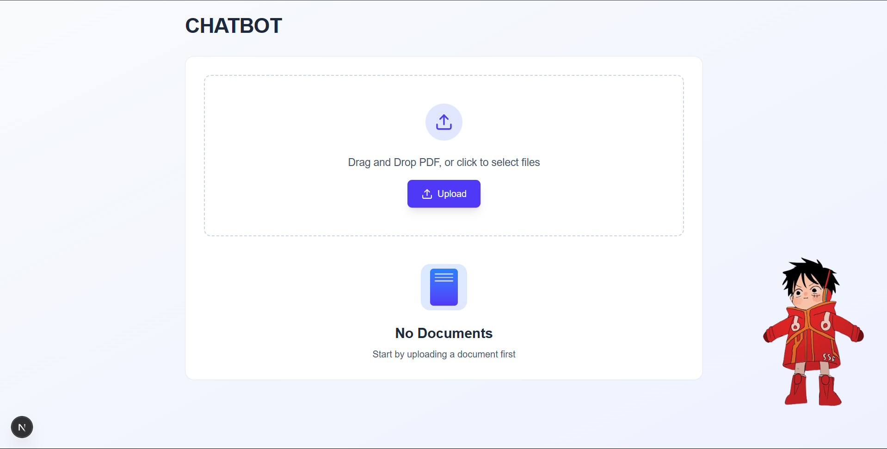
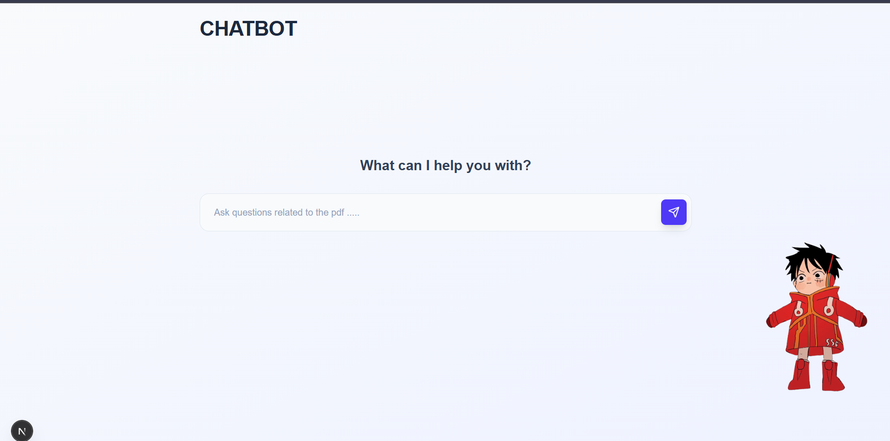
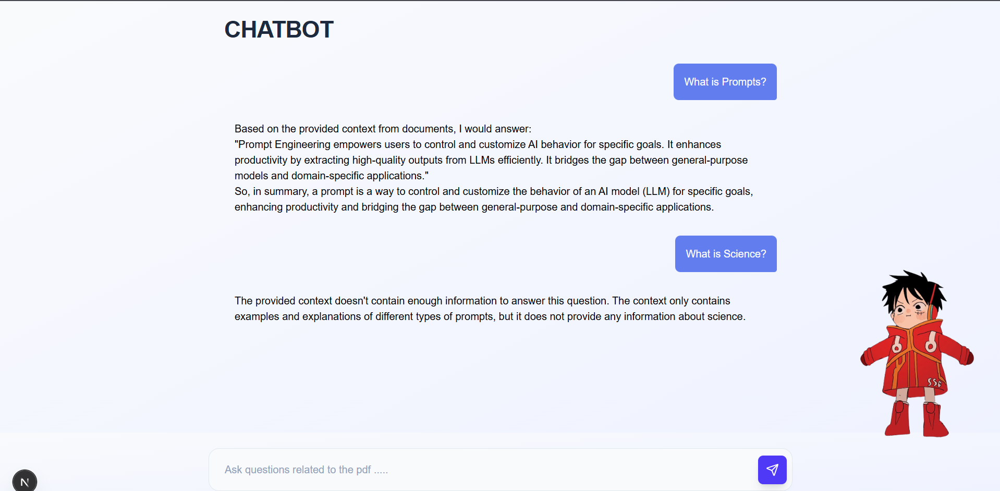

### FullStack RAG

This is a RAG-based chatbot made using Langchain, ChromaDB, and OLLAMA (you can easily use OpenAI or Gemini instead of OLLAMA).

---

#### Features

- **PDF Upload:** Upload a PDF, which is parsed and chunked using PyMuPDFLoader.
- **Vector Database:** ChromaDB stores chunk embeddings and handles indexing.
- **Query:** User asks any question about the PDF.
- **Retrieval:** ChromaDB retrieves top-N relevant chunks using semantic search.
- **LLM Process:** Retrieved chunks are passed to the LLM to generate an answer.

---

#### Backend (FastAPI)

- **Endpoints:**
  - `POST /upload` — Upload and process a PDF file.
  - `POST /query` — Query the processed documents with a question.
  - `DELETE /clear` — Clear all documents from the database.
  - `GET /documents/count` — Get the number of documents in the database.
  - `GET /health` — Health check for backend components.
  - `GET /` — Basic status endpoint.

- **Technologies:**
  - FastAPI (REST API)
  - Langchain (document loading, chunking, embeddings, LLM)
  - ChromaDB (vector database)
  - Ollama (local LLM and embedding models)
  - PyMuPDFLoader (PDF parsing)
  - Loguru (logging)

- **How it works:**
  1. **Startup:** Initializes embeddings, ChromaDB client, and LLM.
  2. **PDF Upload:** Splits PDF into chunks, embeds them, and stores in ChromaDB.
  3. **Query:** Embeds the question, retrieves relevant chunks, and uses the LLM to answer based only on the retrieved context.

---

#### Steps

1. **PDF Upload:** Upload a PDF, which is parsed and chunked using PyMuPDFLoader.
2. **Vector Database:** ChromaDB stores chunk embeddings and handles indexing.
3. **Query:** User asks any question about the PDF.
4. **Retrieval:** ChromaDB retrieves top-N relevant chunks using semantic search.
5. **LLM Process:** Retrieved chunks are passed to the LLM to generate an answer.

---

#### Screenshots

Step 1: User uploads the PDF  


Step 2: Landing page for the chat  


Step 3: User asks a question related to the PDF  


---

#### Running the Backend

1. Install Python dependencies:
   ```bash
   pip install -r requirements.txt
   ```

2. Start the FastAPI backend:
   ```bash
   uvicorn backend.rag:app --reload
   ```

3. Make sure Ollama is running and the required models are installed.

---

#### Running the Frontend

1. Go to the `chatbot` directory:
   ```bash
   cd chatbot
   ```

2. Install dependencies:
   ```bash
   npm install
   # or
   yarn install
   ```

3. Start the Next.js development server:
   ```bash
   npm run dev
   # or
   yarn dev
   ```

---

#### Notes

- The backend expects Ollama to be running locally with the required models (`mxbai-embed-large` for embeddings, `llama3` for LLM).
- You can clear all uploaded documents using the `/clear` endpoint.
- The backend is CORS-enabled for local development.

---


