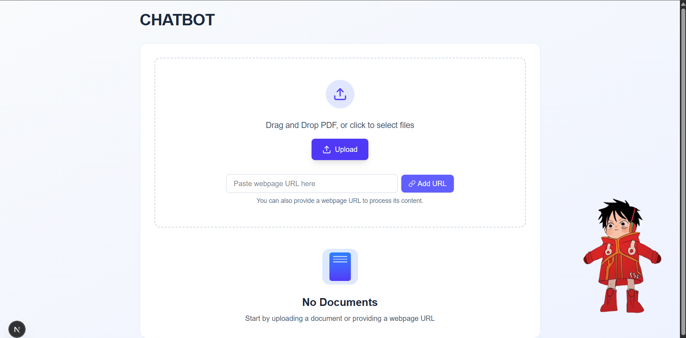
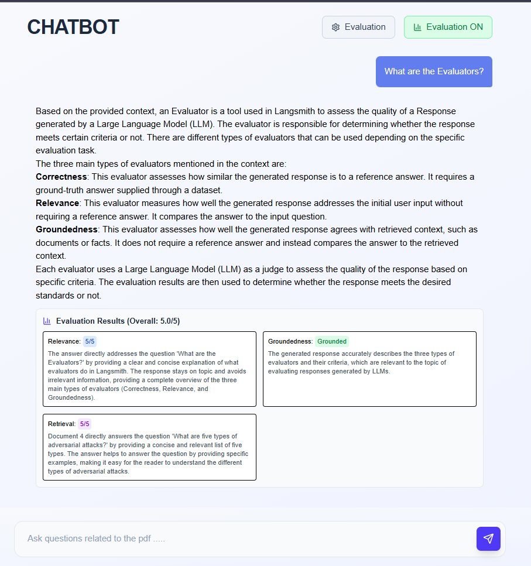

# Enhanced FullStack RAG Pipeline

This is a comprehensive multi-agent RAG-based chatbot system with advanced features including website crawling, performance evaluation, and real-time monitoring.

## Key Features

🕷️ **Advanced Website Crawling**: Multi-page recursive crawling with depth control
📊 **RAG Performance Evaluation**: Comprehensive evaluation system with multiple metrics
📈 **Real-time Monitoring**: Performance metrics and health monitoring
🔍 **Enhanced Content Extraction**: Advanced text processing with multiple extraction methods
⚡ **FastAPI REST API**: Complete API for integration and automation
🤖 **Multi-Agent Architecture**: Specialized agents for different content types
🎯 **Evaluation Metrics**: Correctness, relevance, groundedness, and retrieval quality assessment

---

## Enhanced Multi-Agent Architecture

The system now includes specialized agents with enhanced capabilities:

### **Document Processing Agent**
- Handles PDF document processing and parsing
- Uses PyMuPDFLoader for content extraction  
- Advanced document chunking for optimal context
- Metadata preservation and source tracking

### **Enhanced Web Scraping Agent**
- **Single URL Processing**: Original webpage content extraction
- **Multi-Page Crawling**: Recursive website crawling with configurable depth
- Uses aiohttp for async HTTP requests + trafilatura for advanced content extraction
- BeautifulSoup fallback for HTML parsing and cleaning
- Rate limiting and domain filtering
- Link discovery and queue management

### **RAG Evaluation Agent**
- **Comprehensive Evaluation Metrics:**
  - **Correctness**: Compares answers against ground truth
  - **Relevance**: Measures answer relevance to the question (1-5 scale)
  - **Groundedness**: Checks if answers are supported by retrieved context
  - **Retrieval Relevance**: Evaluates quality of retrieved documents
- **Complete RAG Assessment**: Combined evaluation with overall scoring
- **Batch Evaluation**: Process multiple evaluations simultaneously
- **Real-time Evaluation**: Integrated evaluation with query processing
- **Health Monitoring**: Evaluator status and availability checks

### **Performance Monitoring Agent**
- Real-time query performance tracking
- System health monitoring
- Resource usage monitoring (CPU, memory)
- Historical trend analysis
- Automated alerting for performance issues

- **RAG Orchestrator:**
  - Coordinates between agents
  - Manages the vector database (ChromaDB)
  - Handles embeddings and LLM interactions
  - Provides unified API endpoints

---

#### Features

- **Document Processing:**
  - PDF Upload and parsing
  - Web page content extraction
  - Intelligent text chunking
- **Vector Database:** ChromaDB stores chunk embeddings and handles indexing
- **Query Processing:** Semantic search and context-aware responses
- **Multi-Source Support:** Process both PDFs and web URLs

---

#### Backend (FastAPI)

- **Endpoints:**
  - `POST /upload` — Upload and process a PDF file
  - `POST /url` — Process content from a webpage
  - `POST /query` — Query the processed documents
  - `POST /query_with_evaluation` — Query with automatic evaluation
  - `POST /evaluate/correctness` — Evaluate answer correctness
  - `POST /evaluate/relevance` — Evaluate answer relevance
  - `POST /evaluate/groundedness` — Evaluate answer groundedness
  - `POST /evaluate/retrieval_relevance` — Evaluate retrieval quality
  - `POST /evaluate/complete` — Complete RAG evaluation
  - `POST /evaluate/batch` — Batch evaluation processing
  - `GET /evaluator/health` — Check evaluator status
  - `DELETE /clear` — Clear all documents from the database

- **Technologies:**
  - FastAPI (REST API)
  - Langchain (document processing, embeddings, LLM)
  - ChromaDB (vector database)
  - Ollama (local LLM and embedding models)
  - PyMuPDFLoader (PDF parsing)
  - BeautifulSoup4 (web scraping)
  - aiohttp (async HTTP client)
  - Loguru (logging)
  - **RAG Evaluator**: Custom evaluation system with multiple metrics

#### Frontend (Next.js)

- **Technologies:**
  - Next.js 15 (React framework)
  - TypeScript (type safety)
  - Tailwind CSS (styling)
  - Lucide React (icons)
  - React Markdown (rich text display)

- **Features:**
  - Modern, responsive chatbot interface
  - Real-time evaluation display
  - Comprehensive evaluation settings panel
  - Drag & drop file uploads
  - URL processing interface
  - Interactive evaluation metrics visualization

- **How it works:**
  1. **Startup:** Initializes all agents and components (including RAG evaluator)
  2. **Input Processing:** 
     - Document Agent processes PDFs
     - Scraping Agent processes URLs
  3. **Storage:** Content is chunked and stored in ChromaDB
  4. **Query:** Orchestrator manages retrieval and response generation
  5. **Evaluation:** Optional evaluation of responses using multiple metrics

---

#### Screenshots

Step 1: User uploads the PDF / URL  


Step 2: Landing page for the chat  


Step 3: User asks a question related to the PDF / URL
1. When PDF:  

2. When Url:


### Evaluation on the 3 important basis
Relevance, Groundness and Retrieval



---

#### Steps

1. **PDF Upload:** Upload a PDF, which is parsed and chunked using PyMuPDFLoader.
2. **Web URL Processing:** Submit a web URL for content extraction and processing.
3. **Vector Database:** ChromaDB stores chunk embeddings and handles indexing.
4. **Query:** User asks any question about the PDF or web content.
5. **Retrieval:** ChromaDB retrieves top-N relevant chunks using semantic search.
6. **LLM Process:** Retrieved chunks are passed to the LLM to generate an answer.
7. **Evaluation (Optional):** Responses can be evaluated using various metrics:
   - **Correctness**: Compare against ground truth answers
   - **Relevance**: Rate answer relevance to the question (1-5)
   - **Groundedness**: Verify answers are supported by context
   - **Retrieval Quality**: Assess relevance of retrieved documents

---

#### Agent Interaction Flow

1. **Document Input:**
   - PDF files → Document Processing Agent
   - Web URLs → Web Scraping Agent

2. **Content Processing:**
   - **Document Agent:**
     - Extracts text from PDFs
     - Splits content into optimal chunks
     - Maintains document structure
   
   - **Scraping Agent:**
     - Fetches webpage content asynchronously
     - Cleans HTML and extracts text
     - Handles different webpage structures

3. **RAG Orchestrator:**
   - Receives processed content from both agents
   - Generates embeddings using Ollama
   - Stores in ChromaDB with metadata
   - Handles user queries:
     1. Embeds the question
     2. Retrieves relevant chunks
     3. Generates contextual response using LLM
     4. Optionally evaluates response quality

4. **Evaluation System:**
   - **Real-time Evaluation:** Automatic evaluation during query processing
   - **Individual Metrics:** Test specific aspects (correctness, relevance, etc.)
   - **Batch Processing:** Evaluate multiple responses simultaneously
   - **Health Monitoring:** Track evaluator status and performance

This multi-agent architecture allows for:
- Parallel processing of different content types
- Specialized handling for each source
- Unified query interface for users
- Scalable and maintainable codebase
- **Comprehensive evaluation and quality assessment**
- **Real-time performance monitoring**

---

## Evaluation System

The RAG system includes a comprehensive evaluation framework to assess response quality:

### **Evaluation Metrics**

1. **Correctness (Binary)**
   - Compares student answers against ground truth
   - Returns: `{correct: boolean, explanation: string}`

2. **Relevance (1-5 Scale)**
   - Measures how well the answer addresses the question
   - Returns: `{score: number, explanation: string}`

3. **Groundedness (Binary)**
   - Checks if the answer is supported by the provided context
   - Returns: `{grounded: boolean, explanation: string}`

4. **Retrieval Relevance (1-5 Scale)**
   - Evaluates quality of retrieved documents for the question
   - Returns: `{score: number, explanation: string}`

### **Evaluation Endpoints**

- **Individual Evaluations**: Test specific metrics separately
- **Complete Evaluation**: Run all metrics and get an overall score
- **Batch Evaluation**: Process multiple evaluations with statistics
- **Query with Evaluation**: Get answers and automatic evaluation

### **Usage Examples**

1. **Basic Query**: `/query` - Get answers without evaluation
2. **Evaluated Query**: `/query_with_evaluation` - Get answers with automatic evaluation
3. **Manual Evaluation**: Use specific `/evaluate/*` endpoints for targeted assessment

---

## Complete User Workflow

### **1. Document Upload/Processing**
- Visit the landing page at `http://localhost:3000`
- Either upload PDF files via drag & drop or click upload
- Or provide a webpage URL for content extraction
- Documents are processed and stored in the vector database

### **2. Chat Interface**
- Navigate to the chat interface after document processing
- **Basic Mode**: Ask questions and get AI responses
- **Evaluation Mode**: Enable evaluation for quality assessment

### **3. Evaluation Features**
- Click the "Evaluation" button to access settings
- Toggle evaluation ON/OFF as needed
- Optionally provide ground truth for correctness evaluation
- View comprehensive evaluation results with each response:
  - Overall score (x/5)
  - Individual metric scores with explanations
  - Color-coded indicators for quick assessment

### **4. Evaluation Metrics Explained**
- **Correctness** (Binary): Compares against provided ground truth
- **Relevance** (1-5): How well the answer addresses the question
- **Groundedness** (Binary): Whether answer is supported by retrieved context
- **Retrieval Relevance** (1-5): Quality of documents retrieved for the question

---

## Frontend Features

The Next.js frontend provides a modern, responsive interface with comprehensive evaluation capabilities:

### **Chat Interface**
- **Clean, Modern Design**: Responsive chatbot interface with gradient backgrounds
- **Real-time Messaging**: Instant message sending and receiving
- **Markdown Support**: Rich text rendering for responses
- **Loading Indicators**: Visual feedback during processing

### **Evaluation Interface**
- **Evaluation Toggle**: Easy on/off switch for evaluation mode
- **Evaluation Panel**: Dedicated settings panel with configuration options
- **Ground Truth Input**: Optional field for providing expected answers
- **Real-time Evaluation Display**: Immediate evaluation results with each response

### **Evaluation Results Display**
- **Overall Score**: Combined evaluation score (x/5)
- **Metric Breakdown**: Individual scores for each evaluation metric:
  - **Correctness**: Green/Red badges with explanations
  - **Relevance**: Blue badges with 1-5 scoring
  - **Groundedness**: Green/Red badges for context support
  - **Retrieval Relevance**: Purple badges with 1-5 scoring
- **Detailed Explanations**: Full explanations for each metric result

### **User Experience Features**
- **Drag & Drop**: Easy PDF file uploading
- **URL Processing**: Direct webpage content processing
- **Auto-scroll**: Automatic scrolling to latest messages
- **Error Handling**: Graceful error messages and recovery
- **Responsive Design**: Works on desktop and mobile devices

---

#### Running the Backend

1. Install Python dependencies:
   ```bash
   pip install -r requirements.txt
   ```

2. Start the FastAPI backend:
   ```bash
   python rag.py
   ```

3. Make sure Ollama is running and the required models are installed.

4. **Optional: Run Evaluation Tests**
   ```bash
   python test_evaluation.py
   ```
   This will run a simple evaluation test to verify the evaluation system is working.

---

#### Running the Frontend

1. Go to the `chatbot` directory:
   ```bash
   cd chatbot
   ```

2. Install dependencies:
   ```bash
   npm install
   # or
   yarn install
   ```

3. Start the Next.js development server:
   ```bash
   npx next dev
   # or
   yarn dev
   ```

4. **Access the application:**
   - Open your browser and go to `http://localhost:3000`
   - Upload PDFs or process URLs on the landing page
   - Use the chat interface with optional evaluation features:
     - Click the "Evaluation" button to access settings
     - Toggle "Evaluation ON/OFF" to enable/disable evaluation
     - Provide ground truth for correctness evaluation (optional)
     - View detailed evaluation results with each response

---

#### Notes

- The backend expects Ollama to be running locally with the required models (`mxbai-embed-large` for embeddings, `llama3` for LLM).
- The evaluation system uses the same `llama3` model for assessment.
- You can clear all uploaded documents using the `/clear` endpoint.
- The backend is CORS-enabled for local development.
- Use `/query` for regular queries or `/query_with_evaluation` for automatic evaluation.
- The evaluation system provides detailed explanations for each metric.
- **Frontend Features:**
  - Toggle evaluation mode on/off with the evaluation button
  - Provide ground truth in the evaluation panel for correctness assessment
  - View real-time evaluation results with color-coded metrics
  - All evaluation results include detailed explanations
  - The interface automatically switches between regular and evaluation modes

---


